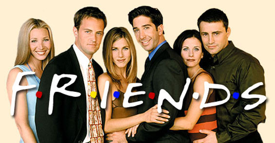
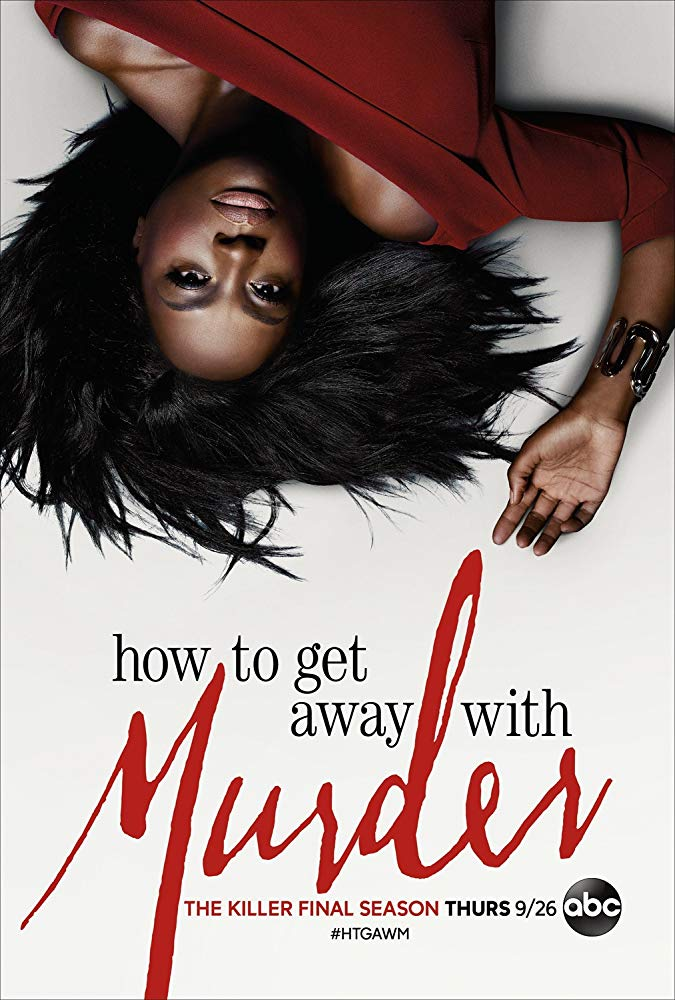

# app-dev
My first repository

## Camilla Perez Naval
### BSCS 501

# Favorite Series 1
## FRIENDS 

>"Because a promise between friends means never having to give a reason." - Phoebe
>"Friends" is a popular American television sitcom that aired on NBC from September 22, 1994, to May 6, 2004. Created by David Crane and Marta Kauffman, the series consists of ten seasons and 236 episodes. Set in New York City, "Friends" revolves around a close-knit group of six friends in their 20s and 30s as they navigate the ups and downs of life, love, and careers."Friends" is celebrated for its humor, relatable characters, and depiction of friendship. The show continues to have a large fan base and remains popular through reruns and streaming services."

#### LINK:
(https://www.tvnz.co.nz/shows/friends)

# Favorite Series 2
# HOW TO GET AWAY WITH MURDER

>" We are all bad people. That's the only thing we have in common."- Bonnie
>"The show is known for its non-linear storytelling, with each season centered on a central mystery or legal case that plays out over the course of the episodes. Future flashbacks add suspense and intrigue by leaving viewers to piece together the events leading up to the central crime."How to Get Away with Murder" received critical acclaim for its complex narrative structure, strong performances, and the groundbreaking casting of Viola Davis as the lead, which made her the first African American woman to win a Primetime Emmy Award for Outstanding Lead Actress in a Drama Series. While maintaining a suspenseful and engaging storyline, the show also addressed social issues such as race, gender, and sexuality."

#### LINK:
(https://www.netflix.com/ph-en/title/80024057)
